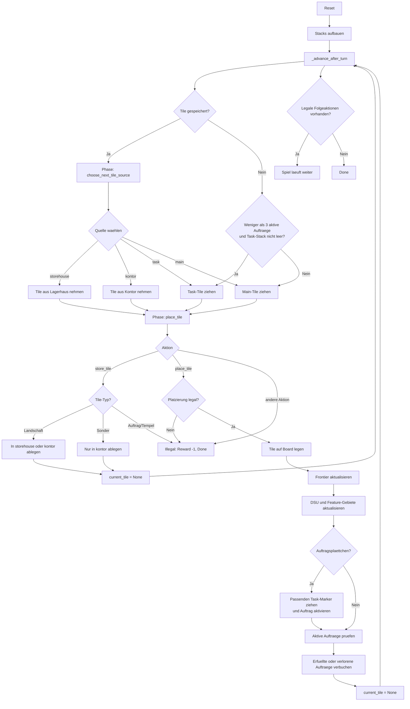

# Spielfluss-Diagramm

Dieses Dokument beschreibt den aktuell implementierten Spielfluss aus [`src/dorfromantik/env.py`](/C:/Users/Kevin/PycharmProjects/dorfromantik-ml/src/dorfromantik/env.py).

## Mermaid

## Dateien

- Mermaid-Quelle: [`docs/diagramme/spielfluss.mmd`](/C:/Users/Kevin/PycharmProjects/dorfromantik-ml/docs/diagramme/spielfluss.mmd)
- SVG-Ausgabe: [`docs/diagramme/spielfluss.svg`](/C:/Users/Kevin/PycharmProjects/dorfromantik-ml/docs/diagramme/spielfluss.svg)
